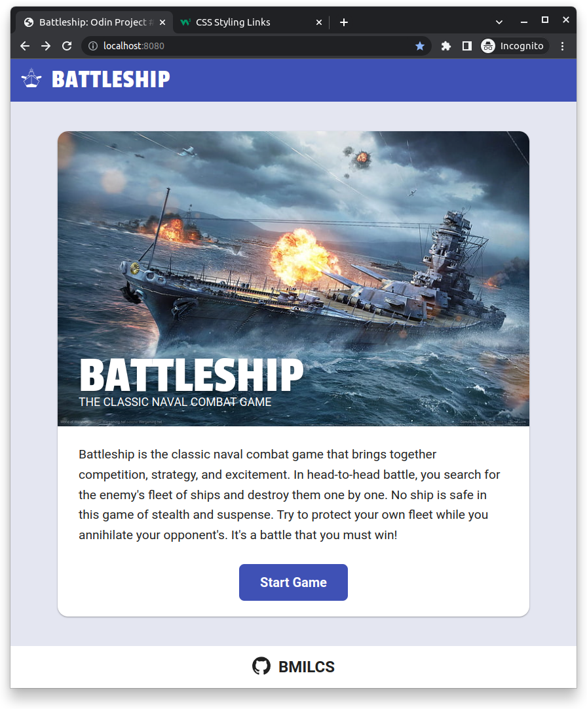
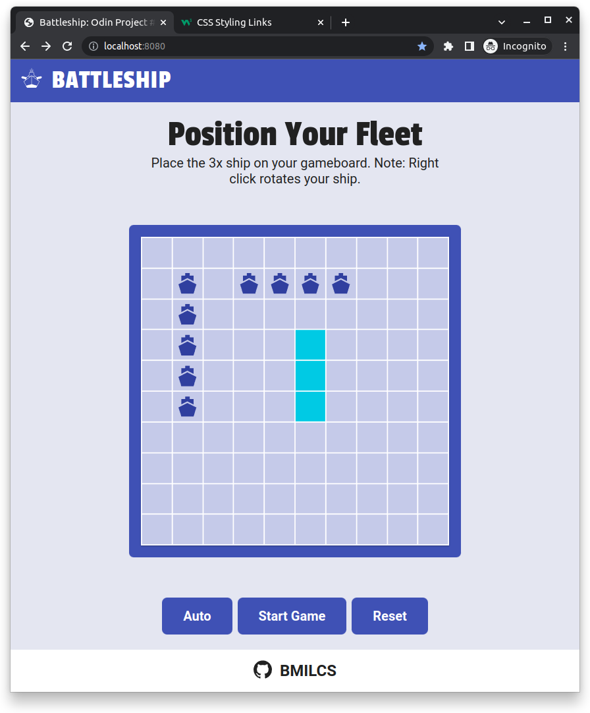
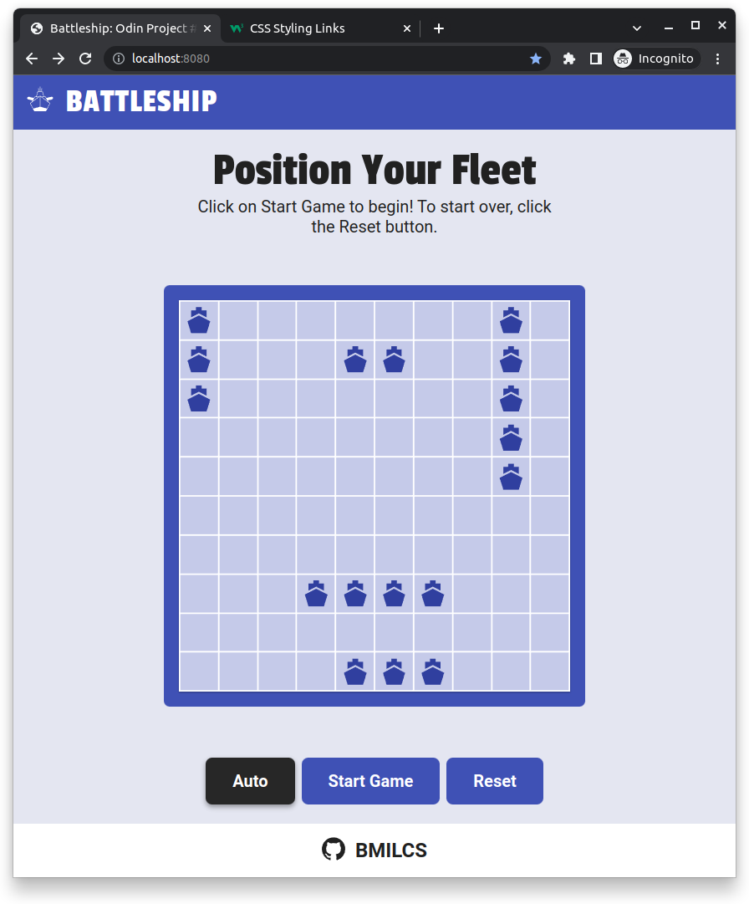
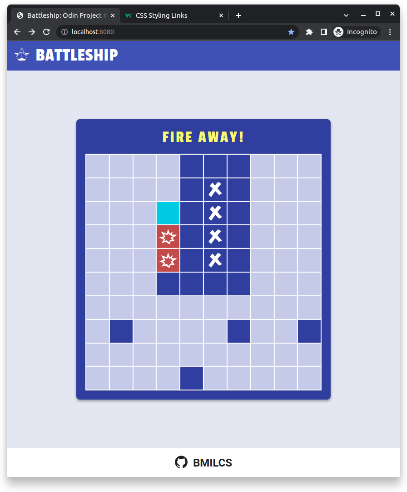
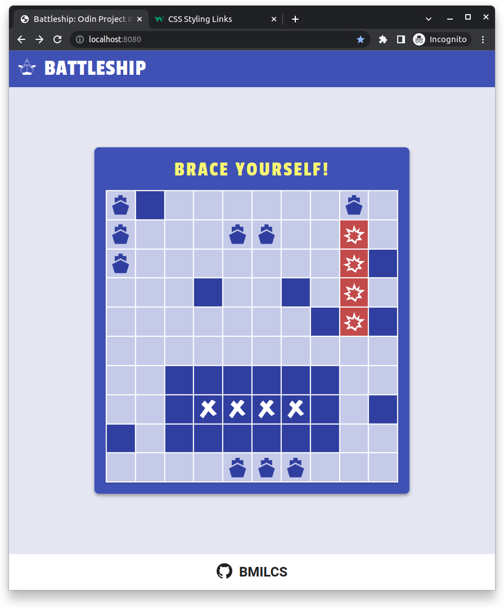
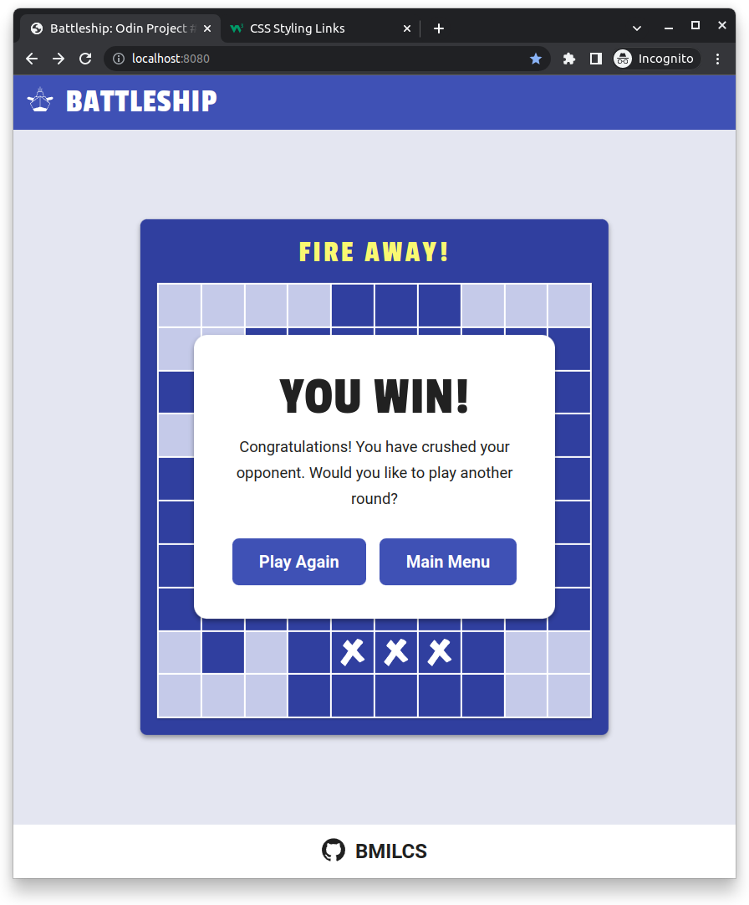

# Odin Project #18: Battleship

Welcome to Bryan Miller's Battleship Project, the [eighteenth assignment](https://www.theodinproject.com/lessons/node-path-javascript-battleship) within the Odin Project curriculum. The goal of this repo is to practice the following skill sets:

- Test Driven Development
- Vanilla JavaScript
  - Recursion
  - Stacks
  - Factories
- NPM
  - Jest
  - Webpack
  - Babel
  - ESLint
  - Prettier

## Summary

This project was a blast and taught me the power of test driven development. This project, unlike all others in the Odin Project cirriculum, started with writing tests, instead of solutions, to the easiest problems to solve. From there, I wrote syntax to make those tests pass:

- Ship Factory: creates ship objects, capable of receiving hits and returning true/false if sunk
- Gameboard Factory: creates gameboard objects, capable of placing friendly ships on them, as well as receiving attacks and sending those attacks to the corresponding ship object
- Player Factory: creates player objects, who get their own gameboard object instance and the ability to attack an enemy gameboard

`app.js` controls the flow of the game. It connects the DOM-related related methods in `dom.js` to the player functionality in `player.js`.

The real challenge and satisfaction came from implementing the computer's artificial intelligence. Having gone through linked lists and binary search trees recently, I was still feeling a little shaky about recursion, stacks and how they relate to real world problems. Following the 'Single Responsibility' principle, I had a great foundation of pre-built functions ready to go. Therefore, solving problems such as placing a ship randomly on the gameboard came about naturally by piecing together smaller solutions into a cohesive unit.

The AI isn't perfect. It attacks at random until it gets lucky with a random coordinate. If I had the free time, I would've implemented a data structure of some kind to determine the best next random move, opting for spaces that have the largest # of unplayed adjacent moves. This would reduce the number of random attacks that fall next to one another, allowing the computer to hit larger open areas of unchartered territory.

Ultimately, I was able to complete this project entirely on my own with very minimal Googling. Unlike previous projects, I spent a total of 2 weeks on this one (weekdays after work & weekends). As these projects grow in complexity, naming conventions, comments & organization are becoming vitally important so I spent a little extra time on this to ensure readability and maintability.

React is right around the corner and I'm excited to get into it, so I'll end my summary here.

## Screenshots








## Links

- [Live Demo](https://bmilcs.github.io/odin-battleship/)
- [My Odin Project Progress](https://github.com/bmilcs/odin-project)

## Deployment

```sh
# clone repo
git clone https://github.com/bmilcs/odin-battleship

# install dependencies
npm install --save-dev webpack webpack-cli webpack-dev-server webpack-merge \
  html-webpack-plugin style-loader css-loader sass-loader sass svg-inline-loader
\
  eslint eslint-config-prettier jest @babel/preset-env babel-jest @types/jest
npx install-peerdeps --dev eslint-config-airbnb-base
```
